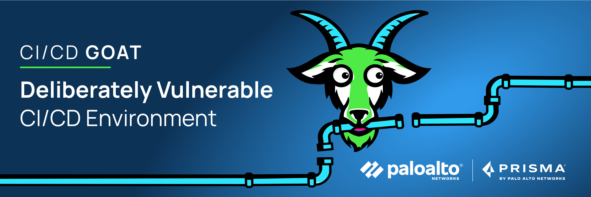
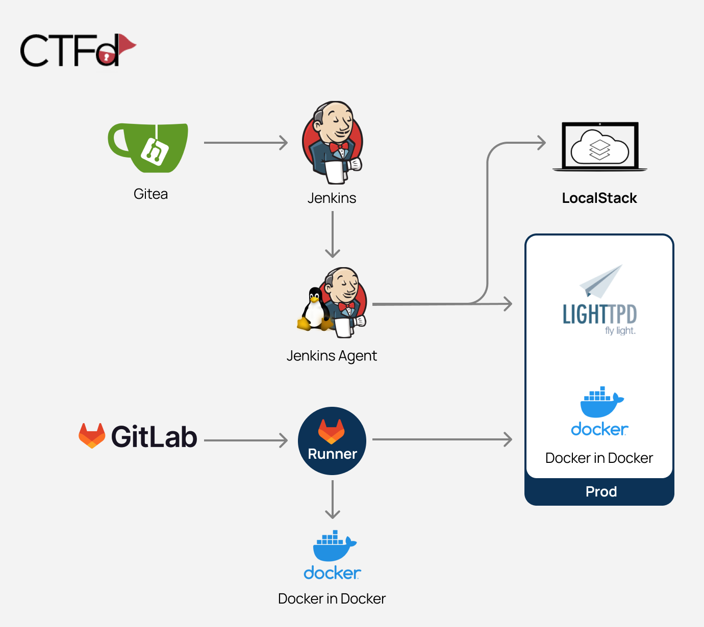

[](https://www.cidersecurity.io/)

[](https://www.cidersecurity.io/?utm_source=github&utm_medium=github_page&utm_campaign=ci%2fcd%20goat%20_060422)
[](https://www.cidersecurity.io/top-10-cicd-security-risks/?utm_source=github&utm_medium=github_page&utm_campaign=ci%2fcd%20goat_060422)
[](https://github.com/cider-security-research/cicd-goat/actions/workflows/release.yaml)
[](https://circleci.com/gh/cider-security-research/cicd-goat/tree/main)


Deliberately vulnerable CI/CD environment.
Hack CI/CD pipelines, capture the flags. :triangular_flag_on_post:

Created by [Cider Security](https://www.cidersecurity.io/?utm_source=github&utm_medium=github_page&utm_campaign=ci%2fcd%20goat%20_060422).

## Table of Contents

* [Description](#Description)
* [Download & Run](#Download--Run)
  * [Linux & Mac](#Linux--Mac)
  * [Windows (Powershell)](#Windows-Powershell)
* [Usage](#Usage)
  * [Instructions](#Instructions)
  * [Take the challenge](#Take-the-challenge)
  * [Troubleshooting](#Troubleshooting)
* [Solutions](#Solutions)
* [Contributing](#Contributing)
  * [Development](#Development)
  * [Checklist](#Checklist)

## Description
The CI/CD Goat project allows engineers and security practitioners to learn and practice CI/CD security through a set of 11 challenges, enacted against a real, full blown CI/CD environment. The scenarios are of varying difficulty levels, with each scenario focusing on one primary attack vector.

The challenges cover the [Top 10 CI/CD Security Risks](https://www.cidersecurity.io/top-10-cicd-security-risks/?utm_source=github&utm_medium=github_page&utm_campaign=ci%2fcd%20goat_060422), including Insufficient Flow Control Mechanisms, PPE (Poisoned Pipeline Execution), Dependency Chain Abuse, PBAC (Pipeline-Based Access Controls), and more.\
The different challenges are inspired by Alice in Wonderland, each one is themed as a different character.

The project’s environment is based on Docker containers and can be run locally. These containers are: 
1. Gitea (minimal git server)
2. Jenkins
3. Jenkins agent
4. LocalStack (cloud service emulator that runs in a single container)
5. Prod - contains Docker in Docker and Lighttpd service 
6. CTFd (Capture The Flag framework)
7. GitLab
8. GitLab runner
9. Docker in Docker

The images are configured to interconnect in a way that creates fully functional pipelines.

[](#)

## Download & Run
**There's no need to clone the repository.**
### Linux & Mac
```sh
curl -o cicd-goat/docker-compose.yaml --create-dirs https://raw.githubusercontent.com/cider-security-research/cicd-goat/main/docker-compose.yaml
cd cicd-goat && docker-compose up -d
```

### Windows (Powershell)
```PowerShell
mkdir cicd-goat; cd cicd-goat
curl -o docker-compose.yaml https://raw.githubusercontent.com/cider-security-research/cicd-goat/main/docker-compose.yaml
get-content docker-compose.yaml | %{$_ -replace "bridge","nat"}
docker-compose up -d
```

## Usage
### Instructions
* **Spoiler alert!** Avoid browsing the repository files as they contain spoilers.
* To configure your git client for accessing private repositories we suggest cloning using the http url.
* In each challenge, find the flag - in the format of _flag#_ (e.g _flag2_), or another format if mentioned specifically.
* Each challenge stands on its own. Do not use access gained in one challenge to solve another challenge.
* If needed, use the hints on CTFd.
* There is no need to exploit CVEs.
* No need to hijack admin accounts of Gitea or Jenkins (named "admin" or "red-queen").

### Take the challenge
1. After starting the containers, it might take up to 5 minutes until the containers configuration process is complete.
2. Login to CTFd at http://localhost:8000 to view the challenges:
   * Username: `alice`
   * Password: `alice`

3. Hack:
   * Jenkins http://localhost:8080
     * Username: `alice`
     * Password: `alice`
   * Gitea http://localhost:3000
     * Username: `thealice`
     * Password: `thealice`
   * GitLab http://localhost:4000
     * Username: `alice`
     * Password: `alice1234`

4. Insert the flags on CTFd and find out if you got it right.

### Troubleshooting
* If Gitea shows a blank page, refresh the page.
* When forking a repository, don't change the name of the forked repository.
* If any of the services doesn't start or is not configured correctly try adding more cpu and memory to the docker engine and update it to the lateset version.

## Solutions
**Warning:** Spoilers! :see_no_evil:

See [Solutions](solutions).

## Contributing
### Development
1. Clone the repository.
2. Rename .git folders to make them usable:<br/>
    ```sh
    ./rename.py git
    ```
3. Install testing dependencies: 
    ```sh
    pip3 install pipenv==2022.8.30
    pipenv install --deploy
    ```
4. Run the development environment to experiment with new changes:
    ```sh
    rm -rf tmp tmp-ctfd/
    cp -R ctfd/data/ tmp-ctfd/
    docker-compose -f docker-compose-dev.yaml up -d
    ```
5. Make the desired changes:
   * All services except CTFd are completely configured as code so desired changes should be made to the files in the appropriate folders.
   * To make changes in CTFd, use the [admin credentials](break-glass.md).

6. Shutdown the environment, move changes made in CTFd and rebuild it:
    ```sh
    docker-compose -f docker-compose-dev.yaml down
    ./apply.sh # save CTFd changes
    docker-compose -f docker-compose-dev.yaml up -d --build
    ```
7. Run tests:
   ```shell
   pytest tests/
   ```
8. Rename .git folders to allow push:
    ```shell
    ./rename.py notgit
    ```
9. Commit and push!

### Checklist
Follow the checklist below to add a challenge:
  1. CTFd:
     1. Write challenge description.
     2. Choose category according to difficulty level.
     3. Make sure the challenge is visible and has value according to difficulty.
     4. Write hints in order of usage.
     5. Add a flag. Make sure to select if it's case-insensitive.
  2. Gitea:
     1. Configure a new repository in gitea.yaml.
     2. Create the repository under [gitea/repositories](gitea/repositories). Use an open-source repository that use the MIT license as a template for the challenge repository.
  3. Jenkins:
     1. Configure Jenkins and add new jobdsl files in the casc.yaml file.
     2. Make sure jobs don't run periodically. Jobs should be triggered by events / polling.
     3. Validate that the new challenge doesn't interfere with other challenges.
  4. GitLab:
     1. Configure Gitlab by changing the gitlab.tf file and run `terraform init` to update lock file.
     2. To upload new repositories add the releqvant line in repositories.sh.
     3. If any additional files are needed place them inside the resources' folder.
  5. Make sure the flag is not accessible when solving other challenges.
  6. Write tests.
  7. Write the solution.
  8. Update README.md if needed.
  9. In order to run the CI, make sure you have a CircleCI account and that you’ve clicked “Set Up Project” on your fork of the project.
  
